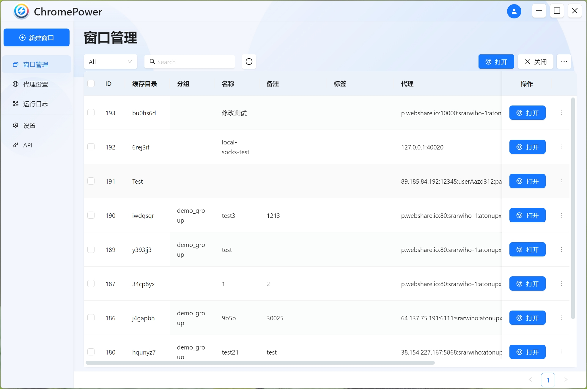

# Chrome Power

---

首款开源指纹浏览器。基于 Puppeteer、Electron、React 开发。

此软件遵循AGPL协议，因此如果你想对其进行修改发布，请保持开源。

Chromium 源码修改请参考 [chrome-power-chromium](https://github.com/zmzimpl/chrome-power-chromium)

## 免责声明

本代码仅用于技术交流、学习，请勿用于非法、商业用途。本代码不保存任何用户数据，同时也不对用户数据负责，请知悉。

## 开始

按照以下步骤开始使用此软件：

- 下载安装包（仅支持Windows） [点击此处下载](https://github.com/zmzimpl/chrome-power-app/releases)
- 以管理员身份运行安装程序以完成安装
- 强烈建议前往设置页面设置你的缓存目录。
- 创建代理
- 创建窗口
  - 创建空白窗口
  - 导入窗口
    - 从模板导入
    - 从 AdsPower 导入

## 功能

- [x] 多窗口管理
- [x] 代理设置
- [x] 中英文支持
- [x] Puppeteer/Playwright/Selenium 接入
- [ ] Mac 安装支持
- [ ] 支持 cookie 导入
- [ ] 扩展程序管理
- [ ] 同步操作
- [ ] 自动化脚本

## 关于 Linux，Mac 支持问题

因为本人没有相关测试环境，请有相关需求的朋友自行通过本地编译运行，本质上与打包安装是相同的，甚至更方便升级。

欢迎 Linux、Mac 用户完善打包功能提 PR

## 本地运行/打包

环境：Node v18.18.2， npm 9.8.1

- 安装依赖 `npm i`
- 手动解压代码目录下的 `Chrome-bin.zip`，注意只有一层目录
- 运行调试 `npm run watch`
- （非必要）打包部署 `npm run publish`，注意打包时要把开发环境停掉，不然会导致 sqlite3 的包打包不了

## API 文档

[Postman API](https://documenter.getpostman.com/view/25586363/2sA3BkdZ61#intro)

## 同类开源工具

- [VirtualBrowser](https://github.com/Virtual-Browser/VirtualBrowser)
- [toolBoxClient](https://github.com/web3ToolBoxDev/toolBoxClient)

## 打赏

🙌你可以通过向下面的钱包打赏一杯咖啡来支持我

Bitcoin Address: `bc1p0uex9rn8nd9uyguulp6r3d3t9kylrk42dg6sq22f3h5rktlk22ks6mlv6t`

Ethereum Address: `0x83DF381FF65806B68AA1963636f4ca87990F2860`
